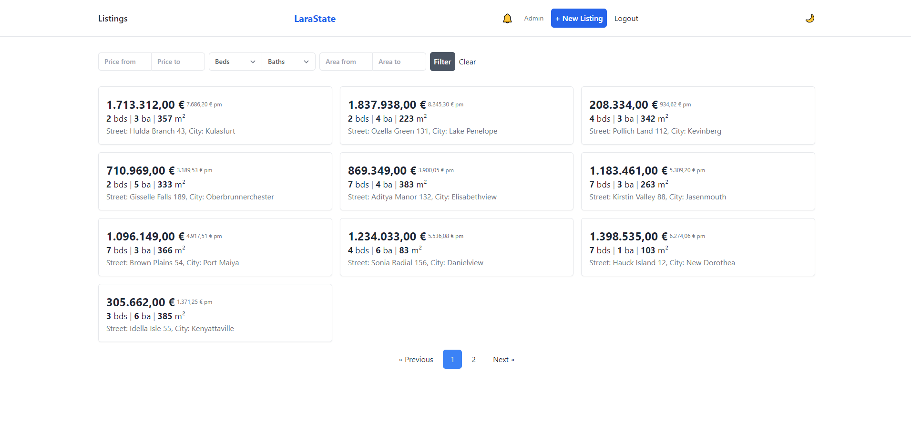

#  Larastate

Laravel SPA application for listing real estate properties. 

## Used technologies
  * Vue.js version 3 + composition API
  * Inertia.js
  * Tailwind CSS

## Quick start
- run `composer install`
- run `npm install`
- build assets using `npm run dev`
- create .env file from .env.example `cp .env.example .env`
- generate keys using `php artisan key:generate`
- migrate & seed database using `php artisan migrate --seed`
- link storage using `php artisan storage:link`
